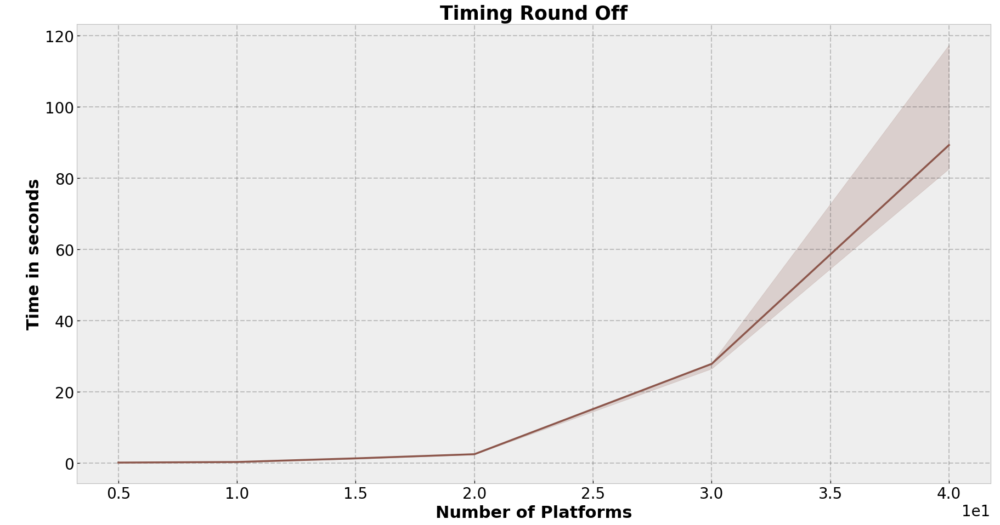
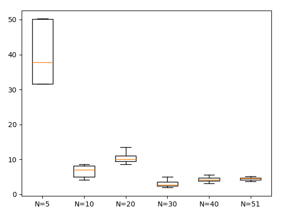

# Helicopter Routing in Offshore Areas - Linear and Combinatorial Optimization

This project addresses the problem of scheduling helicopter flights to offshore platforms for crew exchanges. The solution is based on **Linear Optimization (LO-Model)** using the **Column Generation** technique. Since the solution requires integer values, a **rounding procedure** is applied to obtain integer solutions. 

## Problem Overview

The helicopter routing problem is a type of **Vehicle Routing Problem (VRP)**. The task is to transport crew members between an airport and offshore platforms, subject to several constraints:

- **Helicopter Capacity**: Each helicopter has limited seating capacity.
- **Flight Range**: Helicopters can only fly a certain distance before refueling.
- **Crew Demand**: Each platform requires a specific number of crew exchanges.
- **Flight Time**: Helicopters can only fly during certain hours (daytime, weekdays).

### Objective:
Minimize the total flight distance while fulfilling all crew exchange requirements and adhering to helicopter capacity and range constraints.

## Mathematical Model

The problem is modeled as a **Linear Program (LP)**, where the objective is to minimize the total distance:

\[
\min \sum_{j=1}^{F} d_j x_j
\]

Where:
- \( x_j \) represents the number of times flight \( f_j \) is executed.
- \( d_j \) is the distance traveled by flight \( f_j \).

### Constraints:
- Each platform's crew exchange requirements are met.
- Helicopter capacity and range limits are respected.

## Solution Methodology

### 1. Column Generation
Column generation is used to solve the model efficiently since the number of feasible flights grows exponentially with the number of platforms. The steps include:
1. **Initial Feasible Solution**: Start with a basic set of flights.
2. **Solve Relaxed LP**: Solve the linear relaxation of the problem to calculate dual values.
3. **Subproblem**: Solve a subproblem to generate new feasible flights by minimizing reduced costs.
4. **Iteration**: Add new columns (flights) to the model and repeat until convergence.

### 2. Rounding Procedure
Once the relaxed solution is found, a **rounding-off algorithm** is applied to obtain integer solutions. This involves:
- Adjusting fractional flight counts to integer values.
- Recalculating demands and updating the schedule.

### 3. Lexicographic Search & Pruning
The algorithm is further optimized by using a **lexicographic search** to generate subsets of flights efficiently, and pruning infeasible subsets early based on capacity or range violations.

## Results

The algorithm has been tested for various problem sizes (number of platforms \( N \) from 5 to 40). The results show that the computational complexity increases exponentially with \( N \), which aligns with theoretical predictions.


Performance metrics such as percentage diviation from column generation optimality are provided for each scenario.


## Dependencies

To run the code, you'll need the following Python libraries:
- `numpy`
- `matplotlib`
- `scipy`
- `pulp`

You can install these libraries using pip:
```bash
pip install numpy matplotlib scipy pulp
